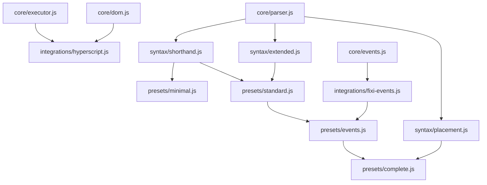

# HyperFixi Modular Architecture Design

## **🎯 Goal: Tree-Shakeable Module System**

Transform the monolithic 13.4KB HyperFixi into a modular system where users only bundle features they actually use.

## **📊 Target Bundle Sizes**

| Preset | Features | Target Size | Use Case |
|--------|----------|-------------|----------|
| **Minimal** | Shorthand syntax only | ~2KB | Basic GET requests |
| **Standard** | Shorthand + extended | ~4KB | Most applications |
| **Events** | Standard + fixi events | ~6KB | Full compatibility |
| **Complete** | All features | ~8KB | Maximum functionality |

## **🏗️ Module Structure**

```
src/
├── core/                    # Essential utilities
│   ├── parser.js           # Basic parsing utilities  
│   ├── executor.js         # HTTP request execution
│   ├── dom.js             # DOM manipulation
│   └── events.js          # Event emission utilities
├── syntax/                 # Syntax parsers
│   ├── shorthand.js       # fetch /url and replace #target
│   ├── extended.js        # fetch /url with method: 'POST'
│   └── placement.js       # replace, put into, append to, prepend to
├── integrations/           # Library integrations
│   ├── hyperscript.js     # _hyperscript command registration
│   └── fixi-events.js     # Fixi event compatibility
├── presets/               # Pre-built combinations
│   ├── minimal.js         # Core + shorthand only
│   ├── standard.js        # Shorthand + extended syntax
│   ├── events.js          # Standard + fixi events
│   └── complete.js        # Everything included
└── index.js               # Main export with all options
```

## **🔧 Module Dependencies**



## **🧪 TDD Strategy**

### **Critical Path Testing**
1. **Core Module Tests** - Essential utilities must be 100% reliable
2. **Syntax Module Tests** - Parser accuracy is critical  
3. **Integration Tests** - Module composition must work
4. **Bundle Size Tests** - Tree-shaking effectiveness validation
5. **Compatibility Tests** - Ensure no breaking changes

### **Test Categories**

#### **Unit Tests (Per Module)**
```javascript
// core/parser.test.js
describe('Core Parser', () => {
  test('parseURL extracts URL expressions correctly');
  test('parseTarget handles CSS selectors');
  test('parseOptions handles key-value pairs');
});

// syntax/shorthand.test.js  
describe('Shorthand Syntax', () => {
  test('parses replace placement');
  test('parses put into placement');
  test('handles optional and connector');
});
```

#### **Integration Tests (Module Combinations)**
```javascript
// integration/composition.test.js
describe('Module Composition', () => {
  test('minimal preset works correctly');
  test('standard preset includes expected features');
  test('modules can be combined manually');
});
```

#### **Bundle Tests (Tree-Shaking Validation)**
```javascript
// bundle/tree-shaking.test.js
describe('Tree Shaking', () => {
  test('minimal bundle excludes extended syntax');
  test('bundle sizes meet targets');
  test('unused modules eliminated');
});
```

## **📦 Export Patterns**

### **Named Exports (Granular)**
```javascript
// Individual modules
export { parseURL, parseTarget } from './core/parser.js';
export { parseShorthandSyntax } from './syntax/shorthand.js';
export { executeCommand } from './core/executor.js';

// Composition utilities
export { createFetchCommand } from './core/builder.js';
export { registerHyperscriptCommand } from './integrations/hyperscript.js';
```

### **Preset Exports (Convenience)**
```javascript
// Quick access to common configurations
export { default as minimal } from './presets/minimal.js';
export { default as standard } from './presets/standard.js';
export { default as complete } from './presets/complete.js';
```

### **Tree-Shaking Friendly**
```javascript
// All exports marked as pure
export /* #__PURE__ */ function parseURL() { /* ... */ }
export /* #__PURE__ */ function createMinimalFetch() { /* ... */ }
```

## **🎛️ Usage Patterns**

### **1. Preset Usage (Recommended)**
```javascript
// Minimal - 2KB
import { minimal } from 'hyperfixi/presets';
minimal.register(_hyperscript);

// Standard - 4KB  
import { standard } from 'hyperfixi/presets';
standard.register(_hyperscript);
```

### **2. Custom Composition (Advanced)**
```javascript
// Build exactly what you need
import { createFetchCommand } from 'hyperfixi/core';
import { withShorthand } from 'hyperfixi/syntax';
import { withFixiEvents } from 'hyperfixi/integrations';

const fetchCommand = createFetchCommand({
  syntax: [withShorthand],
  events: [withFixiEvents],
  placements: ['replace', 'put into'] // Only needed placements
});

_hyperscript.addCommand('fetch', fetchCommand);
```

### **3. Granular Imports (Expert)**
```javascript
// Maximum control
import { parseURL } from 'hyperfixi/core/parser';
import { handleReplace } from 'hyperfixi/syntax/placement';
import { emitFixiEvents } from 'hyperfixi/integrations/fixi-events';

// Compose your own command
```

## **📏 Size Targets & Validation**

### **Bundle Size Constraints**
```javascript
// Automated size checking
const BUNDLE_LIMITS = {
  'presets/minimal': 2048,    // 2KB
  'presets/standard': 4096,   // 4KB  
  'presets/events': 6144,     // 6KB
  'presets/complete': 8192    // 8KB
};

// CI/CD validation
test('Bundle sizes within limits', () => {
  for (const [preset, limit] of Object.entries(BUNDLE_LIMITS)) {
    const size = getBundleSize(preset);
    expect(size).toBeLessThanOrEqual(limit);
  }
});
```

### **Tree-Shaking Validation**
```javascript
// Verify unused code elimination
test('Tree shaking eliminates unused modules', () => {
  const minimalBundle = analyzeBundleContent('presets/minimal');
  
  expect(minimalBundle).not.toContain('parseExtendedSyntax');
  expect(minimalBundle).not.toContain('emitFixiEvents');
  expect(minimalBundle).toContain('parseShorthandSyntax');
});
```

## **🔄 Migration Strategy**

### **Backwards Compatibility**
```javascript
// Legacy import still works
import 'hyperfixi'; // Loads complete preset

// Modern tree-shakeable imports
import { minimal } from 'hyperfixi/presets';
```

### **Progressive Adoption**
1. **Phase 1**: Add modular exports alongside monolithic
2. **Phase 2**: Encourage preset usage with documentation
3. **Phase 3**: Deprecate monolithic import
4. **Phase 4**: Remove monolithic (next major version)

## **🎯 Success Metrics**

### **Bundle Size Reduction**
- **Minimal**: 85% size reduction (13.4KB → 2KB)
- **Standard**: 70% size reduction (13.4KB → 4KB)
- **Complete**: 40% size reduction (13.4KB → 8KB)

### **Developer Experience**
- **Clear import paths** for different use cases
- **Predictable bundle sizes** for each preset
- **No breaking changes** during migration
- **Comprehensive documentation** with examples

### **Performance Impact**
- **Faster parsing** (less code to execute)
- **Smaller downloads** (better mobile experience)
- **Better caching** (granular module caching)

## **🚀 Implementation Phases**

1. **Phase 1**: Extract core utilities (parser, executor, DOM)
2. **Phase 2**: Create syntax modules (shorthand, extended, placement)  
3. **Phase 3**: Build integration modules (hyperscript, fixi-events)
4. **Phase 4**: Compose preset bundles with size validation
5. **Phase 5**: Add comprehensive TDD coverage
6. **Phase 6**: Validate tree-shaking effectiveness
7. **Phase 7**: Performance benchmarking and optimization